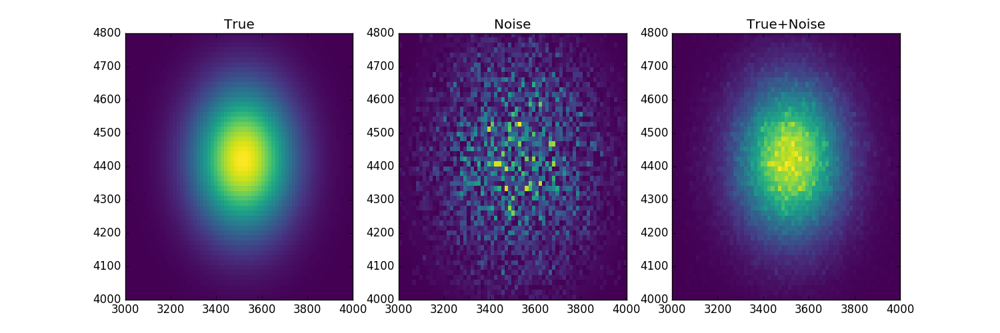
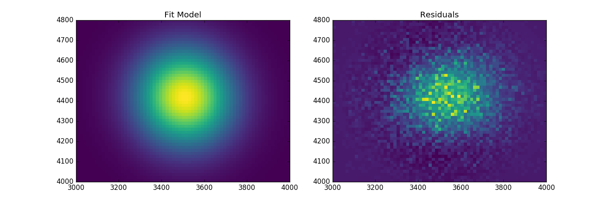

Fitting 2D data
===============

Heres how you fit 2D data!

.. code-block:: ipython

	from astropy.modeling.astro_sherpa import SherpaFitter
	from astropy.modeling.models import Gaussian2D
	from sherpa.stats import Chi2
	import numpy as np

So lets define some data based on `astropy.modeling.models.Gaussian2D`

.. code-block:: ipython

	np.random.seed(123456789)
	x0low, x0high = 3000, 4000
	x1low, x1high = 4000, 4800
	dx = 15
	x1, x0 = np.mgrid[x1low:x1high:dx, x0low:x0high:dx]
	shape = x0.shape

	truth = Gaussian2D(x_mean=3512, y_mean=4418, x_stddev=150, y_stddev=150,
                   theta=20, amplitude=100)

	mexp = truth(x0, x1).reshape(shape)
	merr = abs(np.random.poisson(mexp) - mexp)

Now we have some data lets fit a model after the parameters have been offset.
We simply flatten the arrays. We will also adjust the error bars for the fit.

.. code-block:: ipython
	
	sfit = SherpaFitter(statistic=Chi2)
	fitmo = truth.copy()
	fitmo.x_mean = 3650
	fitmo.y_mean = 4250
	fitmo.x_stddev = 100
	fitmo.y_stddev = 100
	fitmo.theta = 10
	fitmo.amplitude = 50

	fitmo = sfit(fitmo, x0.flatten(), x1.flatten(), mexp.flatten()+merr.flatten(), xbinsize=np.ones(x0.size)*dx, ybinsize=np.ones(x1.size)*dx, err=merr.flatten()+np.random.uniform(-0.5,0.5,x0.size))

