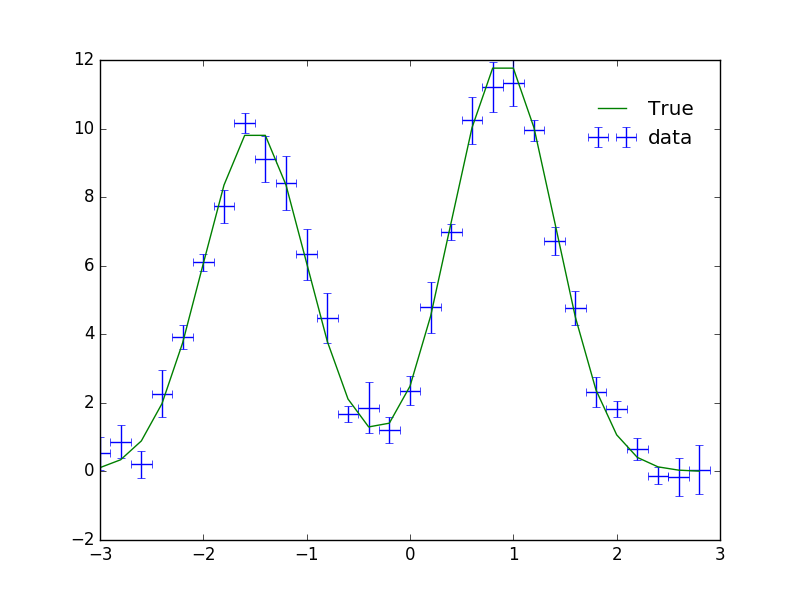
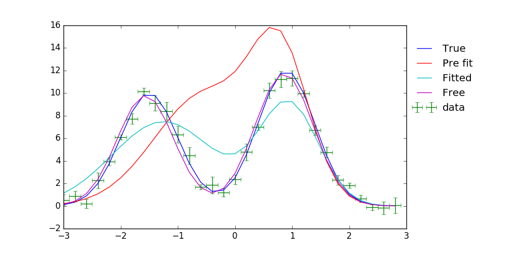
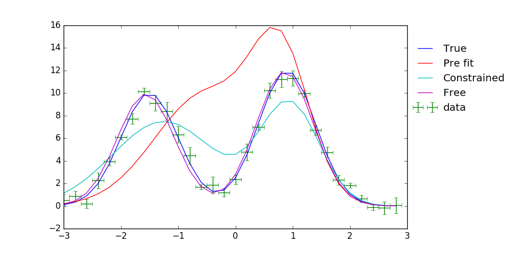
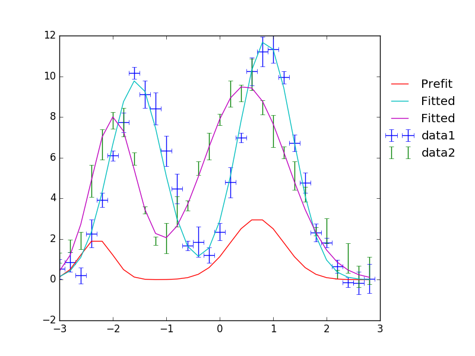
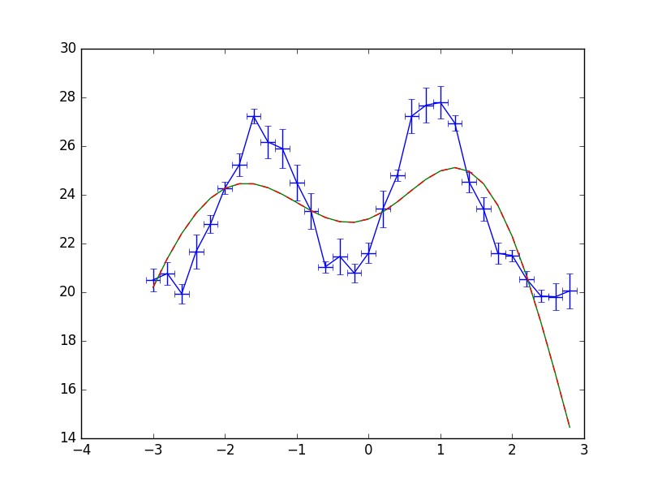

.. include:: references.txt

Usage details
==============

Now that you have the basics let's move on to some more complex usage of the fitter interface.
First a quick preamble to do some imports and create our |SherpaFitter| object:

.. code-block::ipython

    from astropy.modeling.fitting import SherpaFitter
    sfit = SherpaFitter(statistic='chi2', optimizer='levmar', estmethod='confidence')

    from astropy.modeling.models import Gaussian1D
    import numpy as np
    np.random.seed(0x1337)

Parameter constraints
---------------------

If you place any of the parameter constraints on the astropy models then they will be respected by the fitter. Let's take a quick look at that. Firstly let's make a compound model by adding two `~astropy.modeling.functional_models.Gaussian1D` instances:

.. code-block:: ipython

    double_gaussian = (Gaussian1D(amplitude=10, mean=-1.5, stddev=0.5) +
                       Gaussian1D(amplitude=3, mean=0.9, stddev=0.5))

Now we have the compound model lets add tie `amplitude_1` (the amplitude of the right hand side `~astropy.modeling.functional_models.Gaussian1D`) to `1.2*amplitude_0` and while we're at it let us generate some data, too.
To do this we must first define the `tiedfunc`:

.. code-block:: ipython

    def tiedfunc(self): # a function used for tying amplitude_1
        return 1.2*self.amplitude_0

    double_gaussian.amplitude_1.tied = tiedfunc

    err = 0.8
    step = 0.2
    x = np.arange(-3, 3, step)
    y = double_gaussian(x) + err * np.random.uniform(-1, 1, size=len(x))
    yerrs = err * np.random.uniform(0.2, 1, size=len(x))
    binsize=(step/2) * np.ones(x.shape)

.. note :: without astropy PR #5129 we need to do this
    ``double_gaussian.amplitude_1.value = double_gaussian.amplitude_1.tied(double_gaussian)``

Let's add some more parameter constraints to the model and fit the data.
We can print the sherpa models to check things are doing what they should.

.. code-block:: ipython

    fit_gg = double_gaussian.copy()
    fit_gg.mean_0.value = -0.5
    # sets the lower bound so we can force the parameter against it
    fit_gg.mean_0.min = -1.25
    fit_gg.mean_1.value = 0.8
    fit_gg.stddev_0.value = 0.9
    fit_gg.stddev_0.fixed = True

Fitting Config
--------------

An initialized `~saba.SherpaFitter` object has the `opt_config` property which holds the configuration details for the optimization routine. It's docstring contains information about the the properties of the optimizer.

.. code-block:: ipython

    print(sfit.opt_config)
    print(sfit.opt_config.__doc__)  # as help returns the help for the returned object

.. code-block:: ipython

    {'epsfcn': 1.1920928955078125e-07,
     'factor': 100.0,
    'ftol': 1.1920928955078125e-07,
    'gtol': 1.1920928955078125e-07,
    'maxfev': None,
    'verbose': 0,
    'xtol': 1.1920928955078125e-07}

    Levenberg-Marquardt optimization method.

    The Levenberg-Marquardt method is an interface to the MINPACK
    subroutine lmdif to find the local minimum of nonlinear least
    squares functions of several variables by a modification of the
    Levenberg-Marquardt algorithm [1]_.

    Attributes
    ----------
    ftol : number
       The function tolerance to terminate the search for the minimum;
       the default is sqrt(DBL_EPSILON) ~ 1.19209289551e-07, where
       DBL_EPSILON is the smallest number x such that `1.0 != 1.0 +
       x`. The conditions are satisfied when both the actual and
       predicted relative reductions in the sum of squares are, at
       most, ftol.

    xtol : number
       The relative error desired in the approximate solution; default
       is sqrt( DBL_EPSILON ) ~ 1.19209289551e-07, where DBL_EPSILON
       is the smallest number x such that `1.0 != 1.0 + x`. The
       conditions are satisfied when the relative error between two
       consecutive iterates is, at most, `xtol`.

    ...

The parameters can be changed by

.. code-block:: ipython

    sfit.opt_config['ftol'] = 1e-5
    print(sfit.opt_config)

.. code-block:: ipython

    {'epsfcn': 1.1920928955078125e-07,
     'factor': 100.0,
     'ftol': 1e-05,
     'gtol': 1.1920928955078125e-07,
     'maxfev': None,
     'verbose': 0,
     'xtol': 1.1920928955078125e-07}

Fitting this model is the same as earlier and we can also fit an unconstrained model for comparison:

.. code-block:: ipython

    fitted_gg = sfit(fit_gg,x, y, xbinsize=binsize, err=yerrs)

    sfit2 = SherpaFitter(statistic='chi2', optimizer='levmar', estmethod='covariance')

    free_gg = sfit2(double_gaussian.copy(), x, y, xbinsize=binsize, err=yerrs)

The fitter keeps a copy of the converted model so we can use it to compare the constrained and unconstrained model setups:

.. note ::
    ``wrap\_.amplitude_1``  should be `linked`, sherpa notation of astropy's `tied`
    ``wrap\_.stddev_0`` should be `frozen`, sherpa notation for `fixed`
    and finally ``wrap\_.mean_0``'s value should have moved to its minimum while fitting

    "wrap\_" is just perpended to the model name (we didn't set one so it's blank) on conversion to the sherpa `~sherpa.models.model.Model`.

.. code-block:: ipython

    print("##Fit with constraints")
    print(sfit._fitmodel.sherpa_model)
    print("##Fit without constraints")
    print(sfit2._fitmodel.sherpa_model)

.. code-block:: ipython

    ##Fit with constraints

       Param        Type          Value          Min          Max      Units
       -----        ----          -----          ---          ---      -----
       wrap_.amplitude_0 thawed      5.58947 -3.40282e+38  3.40282e+38
       wrap_.mean_0 thawed        -1.25        -1.25  3.40282e+38
       wrap_.stddev_0 frozen          0.9 -3.40282e+38  3.40282e+38
       wrap_.amplitude_1 linked      6.70736 expr: (1.2 * wrap_.amplitude_0)
       wrap_.mean_1 thawed     0.869273 -3.40282e+38  3.40282e+38
       wrap_.stddev_1 thawed     0.447021 -3.40282e+38  3.40282e+38

    ##Fit without constraints

       Param        Type          Value          Min          Max      Units
       -----        ----          -----          ---          ---      -----
       wrap_.amplitude_0 thawed      6.95483 -3.40282e+38  3.40282e+38
       wrap_.mean_0 thawed     -1.59091 -3.40282e+38  3.40282e+38
       wrap_.stddev_0 thawed     0.545582 -3.40282e+38  3.40282e+38
       wrap_.amplitude_1 linked      8.34579 expr: (1.2 * wrap_.amplitude_0)
       wrap_.mean_1 thawed     0.785016 -3.40282e+38  3.40282e+38
       wrap_.stddev_1 thawed      0.46393 -3.40282e+38  3.40282e+38

Error Estimation Configuration
------------------------------

As with the `~sherpa.optmethods` before we are able to adjust the configuration of the `~sherpa.estmethods`. Some of the properties can be passed through `~saba.SherpaFitter.est_errors` as keyword arguments such as the `sigma` however for access to all options we have the `est_config` property.

.. code-block:: ipython

    print(sfit.est_config)
    sfit.est_config['numcores'] = 5
    sfit.est_config['max_rstat'] = 4
    print(sfit.est_config)

.. code-block:: ipython

    {'eps': 0.01,
     'fast': False,
     'max_rstat': 3,
     'maxfits': 5,
     'maxiters': 200,
     'numcores': 8,
     'openinterval': False,
     'parallel': True,
     'remin': 0.01,
     'sigma': 1,
     'soft_limits': False,
     'tol': 0.2,
     'verbose': False}

    {'eps': 0.01,
     'fast': False,
     'max_rstat': 3,
     'maxfits': 5,
     'maxiters': 200,
     'numcores': 5,
     'openinterval': False,
     'parallel': True,
     'remin': 0.01,
     'sigma': 1,
     'soft_limits': False,
     'tol': 0.2,
     'verbose': False}

Multiple models or multiple datasets
------------------------------------

We have three scenarios we can handle:

- Fitting ``N`` datasets with ``N`` models
- Fitting a single dataset with ``N`` models
- Fitting ``N`` datasets with a single model

If ``N > 1`` for any of the scenarios then calling the fitter will return a list of models. Firstly we look at a single dataset with the two models as above.
We quickly copy the two models above and supply them to the fitter as a list - hopefully we get the same result.

.. code-block:: ipython

    fit_gg = double_gaussian.copy()
    fit_gg.mean_0.value = -0.5
    fit_gg.mean_0.min = -1.25
    fit_gg.mean_1.value = 0.8
    fit_gg.stddev_0.value = 0.9
    fit_gg.stddev_0.fixed = True

    fm1, fm2 = sfit([fit_gg, double_gaussian.copy()], x, y, xbinsize=binsize, err=yerrs)

We also can fit multiple datasets with a single model so let's make a second dataset:

.. code-block:: ipython

    second_gg = double_gaussian.copy()
    second_gg.mean_0 = -2
    second_gg.mean_1 = 0.5
    second_gg.amplitude_0 = 8
    second_gg.amplitude_1 = 5
    second_gg.stddev_0 = 0.4
    second_gg.stddev_1 = 0.8

    y2 = second_gg(x) + err * np.random.uniform(-1, 1, size=len(x))
    y2errs = err * np.random.uniform(0.2, 1, size=len(x))

Here we supply lists for each of the data parameters. You can also use ``None`` for when you don't have something like a missing binsizes - a lack of binsizes is a contrived example but a lack of ``y`` errors is not suitable for a chi:sup:2 fit and you don't want to make a new fitter.

.. code-block:: ipython

    fit_gg = double_gaussian.copy()
    fit_gg.mean_0 = -2.3
    fit_gg.mean_1 = 0.7
    fit_gg.amplitude_0 = 2
    fit_gg.amplitude_1 = 3
    fit_gg.stddev_0 = 0.3
    fit_gg.stddev_1 = 0.5

    fm1, fm2 = sfit(fit_gg, x=[x, x], y=[y, y2], xbinsize=[binsize, None], err=[yerrs, y2errs])

Background Data
---------------

It is also possible specify background data which is required for several of the fit statistics.

This is done by supplying a background array using the `bkg` keyword.  If there is a scaling of the background relative to the source data then you can use the `bkg_scale` keyword

.. code-block:: ipython

    y[y<0]=0
    cfit = SherpaFitter(statistic='cstat', optimizer='levmar', estmethod='covariance')
    cfit(fit_gg, x=x, y=y, xbinsize=binsize, err=yerrs, bkg=y, bkg_scale=0.3)

