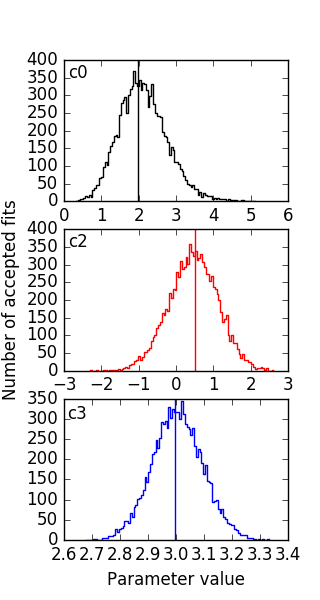
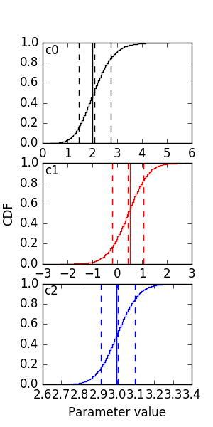

Using sherpa's MCMC sampler
===========================
This is just a very quick example of what can be done with the SherpaMCMC object. Sherpa's MCMC object is aviable from the `get_sampler <sherpafitter.html#astrosherpa_bridge.SherpaFitter.get_sampler>`_ method. 

Let's quickly define some data and a model.

.. code-block:: ipython 

	x = np.arange(0, 10, 0.1)
	y = 2+3*x**2+0.5*x
 	fit_model = Polynomial1D(2)

Now all we have to is define a fitter, find the minima by fitting the model to the data.

.. code-block:: ipython 

	sfitter = SherpaFitter(statistic='cash', optimizer='levmar', estmethod='covariance')
	fitted_model = sfitter(fit_model,x, y, xbinsize=binsize, err=yerrs)

To get the sampler all we have to is this initalised a `astrosherpa_bridge.SherpaMCMC` object with the fitter isntance and returns it.

.. code-block:: ipython 

	sampler = sfitter.get_sampler()

Now before we get the draws from the sampler we can define prior distributions by simply defining the function and using the `set_prior` method we can assign it to a parameter

.. code-block:: ipython 

	def lognorm(x):
	   sigma = 0.5
	   x0 = 1
	   dx = np.log10(x) - x0
	   norm = sigma / np.sqrt(2 * np.pi)
	   return norm * np.exp(-0.5*dx*dx/(sigma*sigma))

	sampler.set_prior("c0",lognorm)

To use the sampler we simply use a function call, passing in the number of draws you wish to make from the sampler.

.. code-block:: ipython	
		
		stat_vals, param_vals, accepted = sampler(niter=20000)

.. code-block:: ipython	
		
		Using Priors:
		wrap_.c0: <function lognorm at 0x7fb9fe95ab18>
		wrap_.c1: <function flat at 0x7fb9fe9cc410>
		wrap_.c2: <function flat at 0x7fb9fe9cc410>

To look at the results we can define some simple helper functions. Firstly a simple function for ploting the bins on a line plot.

.. code-block:: ipython 

	def plotter(xx,yy,c):
	    px=[]
	    py=[]
	    for (xlo,xhi),y in zip(zip(xx[:-1],xx[1:]),yy):
	        px.extend([xlo,xhi]) 
	        py.extend([y,y])
	    plt.figure()
	    plt.plot(px,py,c=c)
	    plt.ylabel("Number")

Secondly we define a fucntion for plotting a historgram from the accepted parameter values.

.. code-block:: ipython

	def plot_hist(mcmc, pname, nbins, c="b"):
	    yy, xx = np.histogram(mcmc.parameters[pname][mcmc.accepted], nbins)
	    plotter(xx, yy, c)
	    plt.axvline(mcmc.parameter_map[pname].val, c=c)
	    plt.xlabel("Value")

And finally we plot the cumulative density function from the accepted parameter values. And some very rough errorbars!

.. code-block:: ipython

	def plot_cdf(mcmc, pname,nbins, c="b", sigfrac=0.682689):
	    y, xx = np.histogram(mcmc.parameters[pname][mcmc.accepted], nbins)
	    
	    cdf = [y[0]]
	    for yy in y[1:]:
	        cdf.append(cdf[-1] + yy)
	    cdf = np.array(cdf)
	    cdf = cdf / float(cdf[-1])
	    
	    plotter(xx,cdf,c)
	    plt.axvline(mcmc.parameter_map[pname].val,c=c) #fit value 
	    
	    #this is inaccurate but gives you and idea
	    siglo = (1 - sigfrac) / 2.0
	    sighi = (1 + sigfrac) / 2.0
	    
	    med_ind = np.argmin(abs(cdf-0.5))
	    lo_ind = np.argmin(abs(cdf - siglo))
	    hi_ind = np.argmin(abs(cdf - sighi))
	    
	    plt.axvline((xx[med_ind] + xx[med_ind + 1]) / 2, ls="--", c=c)
	    plt.axvline((xx[lo_ind] + xx[lo_ind + 1]) / 2, ls="--", c=c)
	    plt.axvline((xx[hi_ind] + xx[hi_ind + 1]) / 2, ls="--", c=c)
	    
	    plt.xlabel("Interation")

We can first plot the histogram of the aceepted draws for each parameter value along with a line for the value from the fit. 

.. code-block:: ipython

	plot_hist(sampler, 'c0', 100, 'k')
	plot_hist(sampler, 'c1', 100, 'r')
	plot_hist(sampler, 'c2', 100, 'b')
	

Then a quick cdf. 

.. code-block:: ipython

	plot_cdf(sampler, 'c0', 100, 'k')
	plot_cdf(sampler, 'c1', 100, 'r')
	plot_cdf(sampler, 'c2', 100, 'b')

Both the fit values and the Draws middle points are about 2, 0.5 and 3 for c0, c1 and c2 repectively which are the true values.