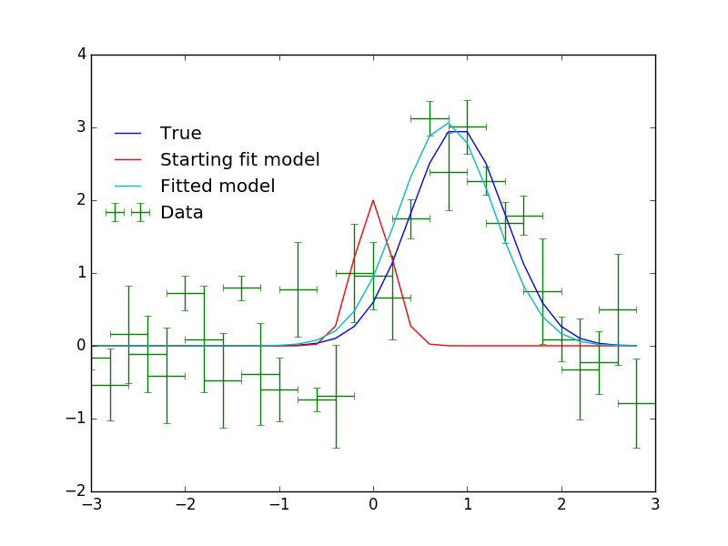
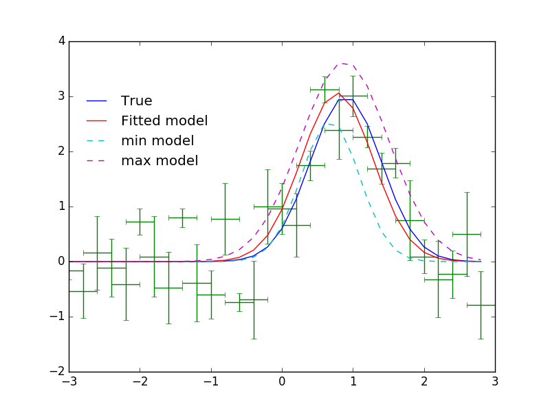

.. include:: references.txt

Saba: Sherpa-Astropy Bridge
===========================

The Saba package provides a bridge between the convenient model definition
language provided in the `astropy.modeling` package and the powerful fitting
capabilities of the Sherpa_ modeling and fitting package.  In particular,
Sherpa has a selection of robust optimization algorithms coupled with
configurable fit statistics.  Once the model fit is complete Sherpa has three
different ways to estimate parameter confidence intervals, including methods
that allow for coupled non-gaussian errors.  Finally, Sherpa has an MCMC
sampler that can be used to generate draws from the probability distribution
assuming given priors.

Once Saba and Sherpa are installed, the Saba package exposes the above Sherpa
functionality within the `astropy.modeling.fitting` package via a single
|SherpaFitter| class which acts as a fitting backend within astropy.  If
using the latest version of astropy (development or >= 1.3), a plugin registry
system automatically makes the |SherpaFitter| class available within the
`astropy.modeling.fitting` module without requiring an explicit import.

``Saba`` is the Sherpa people's word for "bridge".

Installation
------------

The following installation notes apply to the development version of Saba and
assume use of the conda + Anaconda package system.

Prerequisites
^^^^^^^^^^^^^^

 * Python 2.7 (support for Python 3.5+ is in work)
 * numpy
 * astropy
 * sherpa

::

   conda install numpy 

To make use of the entry points plugin registry which automatically makes the |SherpaFitter| class available within `astropy.modeling.fitting` install `astropy` version >= 1.33.

Otherwise one can just use the latest stable ``astropy`` via::  
   
   conda install astropy

Next install Sherpa_ using the conda ``sherpa`` channel.  Note that Sherpa
currently needs to be installed after astropy on Mac OSX.

::

   conda install -c sherpa sherpa

Finally install ``saba`` using pip::

   pip install saba

Getting started
----------------

If you are not already familiar with `astropy.modeling`, now is a good time to
review the introductory documentation there along with the
`astropy.modeling.fitting` module details.

To start with Saba let's import the |SherpaFitter| class which is the interface
with Sherpa's fitting routines.  |SherpaFitter| is available in one of
two ways, either directly from `saba` or through `astropy.modeling.fitting`
through the plugin registry system.  The latter method is preferred but requires
`astropy` version >= 1.3 or the latest development (master) version.  Use:

.. code-block:: ipython

        from saba import SherpaFitter

or

.. code-block:: ipython

        from astropy.modeling.fitting import SherpaFitter

Initialization
^^^^^^^^^^^^^^^

To initialize a fitter we provide string values to define the ``statistic``,
``optimizer`` and ``estmethod`` (error estimation method).  The available
values for those can be found in the docstring of |SherpaFitter| and
relate to objects within `sherpa.stats`, `sherpa.optmethods` and
`sherpa.estmethods`.

.. code-block:: ipython

        sfit = SherpaFitter(statistic='chi2', optimizer='levmar', estmethod='confidence')

Now that we have a fitter instance we need something to fit.  So let's import an
astropy model, specifically `~astropy.modeling.functional_models.Gaussian1D`. A
full description astropy's model and capabilities can be found in the ``astropy``
`Instantiating and Evaluating Models
<http://docs.astropy.org/en/stable/modeling/models.html>`_ section.

.. code-block:: ipython

        from astropy.modeling.models import Gaussian1D

We also need some data so let's make some data with some added noise.

.. code-block:: ipython

        import numpy as np

        np.random.seed(0x1337)
        true = Gaussian1D(amplitude=3, mean=0.9, stddev=0.5)
        err = 0.8
        step = 0.2
        x = np.arange(-3, 3, step)
        y = true(x) + err * np.random.uniform(-1, 1, size=len(x))

        yerrs = err * np.random.uniform(0.2, 1, size=len(x))
        binsize = step * np.ones(x.shape)
        # please note that binsize is the width of the bin!

        fit_model = true.copy() # ofset fit model from true
        fit_model.amplitude = 2
        fit_model.mean = 0
        fit_model.stddev = 0.2

For good measure let's plot it and take a look:

.. image:: _generated/example_plot_data.png
   :width: 500px

Fitting
^^^^^^^

Now we have some data let's fit it and hopefully we get something similar to
"True" back.  The ``sfit`` fitter object has already been initialized (as would
be done for other `astropy.modeling.fitting` fitters) so we just call it with
some data and an astropy model and we get the fitted model returned.

.. code-block:: ipython

        fitted_model = sfit(fit_model, x, y, xbinsize=binsize, err=yerrs)

Once again plotting the data.

Now we have a fit we can look at the outputs by doing:

.. code-block:: ipython

        print(sfit.fit_info)

.. code-block:: ipython

                datasets       = None
                itermethodname = none
                methodname     = levmar
                statname       = chi2
                succeeded      = True
                parnames       = ('wrap_.amplitude', 'wrap_.mean', 'wrap_.stddev')
                parvals        = (3.0646789274093185, 0.77853851419777986, 0.50721937454701504)
                statval        = 82.7366242121
                istatval       = 553.030876852
                dstatval       = 470.29425264
                numpoints      = 30
                dof            = 27
                qval           = 1.44381192266e-07
                rstat          = 3.06431941526
                message        = successful termination
                nfev           = 84

Note that the ``fit_info`` attribute is custom to the |SherpaFitter| class and
provides a direct link to the internal fitting results from the Sherpa fit
process.

Uncertainty estimation
^^^^^^^^^^^^^^^^^^^^^^

One of the main drivers for Saba is to get access the uncertainty estimation
methods provided by Sherpa_.  This is done though the
`~saba.SherpaFitter.est_errors` method which uses the Sherpa's
`~sherpa.fit.Fit.est_errors` method. To get the errors make a call such as:

.. code-block:: ipython

        param_errors = sfit.est_errors(sigma=3)  # Note that sigma can be an input

In return we get a tuple of (``parameter_name``, ``best_fit_value``,
``lower_value`` , ``upper_value``).  For the sake of plotting them we make
models for the upper and lower values, and then output the values while we're at it.

.. code-block:: ipython

        min_model = fitted_model.copy()
        max_model = fitted_model.copy()

        for pname, pval, pmin, pmax in zip(*param_errors):
                print(pname, pval, pmin, pmax)
                getattr(min_model, pname).value = pval + pmin
                getattr(max_model, pname).value = pval + pmax

.. code-block:: ipython

        ('amplitude', 3.0646789274093185, -0.50152026852144349, 0.56964617033348119)
        ('mean', 0.77853851419777986, -0.096264447380365548, 0.10293940565584792)
        ('stddev', 0.50721937454701504, -0.098092469817728456, 0.11585973498734969)

Using Saba
----------

.. toctree::
   :maxdepth: 2

   examples_complex
   examples_2d
   examples_mcmc

API/Reference
-------------

.. toctree::
   :maxdepth: 2

   api.rst

Credit
------

The development of this package was made possible by the generous support of the `Google Summer of Code <https://summerofcode.withgoogle.com/>`_ program in 2016 under the `OpenAstronomy <http://openastronomy.org/>`_ by `Michele Costa <https://github.com/nocturnalastro>`_ with the support and advice of mentors `Tom Aldcroft <https://github.com/taldcroft>`_, `Omar Laurino <https://github.com/olaurino>`_, `Moritz Guenther <https://github.com/hamogu>`_, and `Doug Burke <https://github.com/DougBurke>`_. 
