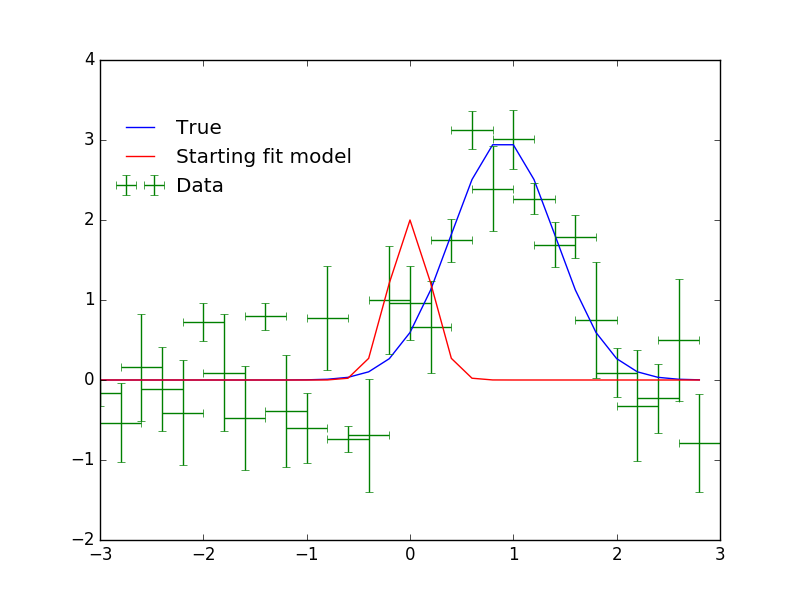

.. |asb| replace:: astropysherpa_bridge
.. |sherpa| replace:: `~sherpa`

How to use SherpaFitter
=======================

I'll show you our API for the bridge. 
Firstly lets import the `SherpaFitter <../sherpafitter.html#astrosherpa_bridge.SherpaFitter>`_ class which is the interface with |sherpa|'s fitting routines.
`SherpaFitter <../sherpafitter.html#astrosherpa_bridge.SherpaFitter>`_ is available through astropy
So it can be imported by: 

.. code-block:: ipython

	from astropysherpa_bridge import SherpaFitter

*or*

.. code-block:: ipython

	from astropy.modeling.fitting import SherpaFitter

To initalise a fitter we simiply provide names for `statistic`, `optimizer` and `estmethod` this aviable value for those can be found in the docstring of `SherpaFitter <../sherpafitter.html#astrosherpa_bridge.SherpaFitter>`_ these relate to objects withing ~sherpa.stats, ~sherpa.opt_methods and ~sherpa.est_methods

.. code-block:: ipython

	sfitter = SherpaFitter(statistic='chi2', optimizer='levmar', estmethod='convariance')

Now we have a fitter instance we need something to fit so lets import an astropy model specifcally :py:class:`Gaussian1D <astropy.modeling.models.Gaussian1D>`

.. code-block:: ipython

	from astropy.modeling.models import Gaussian1D

We also neeed some data so lets make some data with som added noise

.. code-block:: ipython

	import numpy as np

	np.random.seed(0x1337)
	true = Gaussian1D(amplitude=3, mean=0.9, stddev=0.5)
	err = 0.8
	step = 0.2
	x = np.arange(-3, 3, step)
	y = true(x) + err * np.random.uniform(-1, 1, size=len(x))

	yerrs=err * np.random.uniform(0.2, 1, size=len(x))
	binsize=(step / 2) * np.ones(x.shape)  
	# please note that the width of the bin will be 2*binsize!

	fit_model = true.copy() # ofset fit model from true 
	fit_model.amplitude = 2
	fit_model.mean = 0
	fit_model.stddev = 0.2

For good measure lets plot it and take a look

